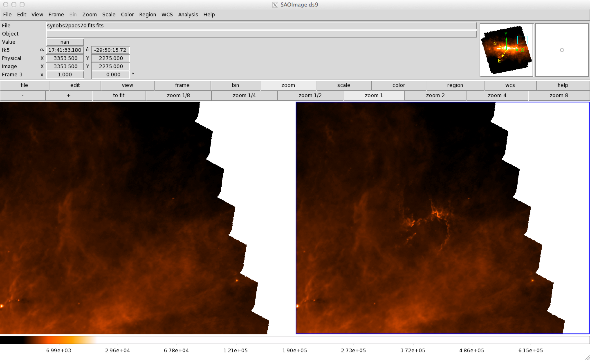

.. _label_interfaces:

==========
Interfaces
==========

The synthetic interface class, called :class:`fluxcompensator.interface.Interface2FITS`, acts as an interface between observations (FITS files) and the ideal radiative transfer output. It supports the direct comparison of real observations stored in FITS files. The FluxCompensator reads information from the header of the FITS file in order to produce realistic synthetic observations with the same wavelength, reddening, pixel resolution and PSF specific for telescope and detector of the real observation. Information, such as the distance, the optical extinction coefficient of the object and the exposure time and/or noise contribution, are input parameters. It is also possible to load detector and telescope information which are not available in the built-in :ref:`label_database` and :ref:`label_compact_pipeline`.

The realistic synthetic observation is saved by the method :meth:`fluxcompensator.interface.Interface2FITS.save2fits`.

When using the built-in interface little knowledge of Python programming is required. We show an example of the FluxCompensator interface code for simulated star-forming region by `Dale et al. 2012 <http://adsabs.harvard.edu/abs/2012MNRAS.424..377D>`_::

    import numpy as np 
    from hyperion.util.constants import pc, kpc, au 
    from hyperion.model import ModelOutput 
     
    from fluxcompensator.interface import Interface2FITS 
    from fluxcompensator.database.compact_pipeline import HIGAL_PACS1
     
    # passing RT output from Hyperion
    m = ModelOutput('hyperion_output.rtout') 
    RT_calculation = m.get_image(group=0, inclination=0, distance=8.5*kpc, units='ergs/cm^2/s') 
    
    # setting up interface and providing information about the real observation
    FC_interface = Interface2FITS(obs='pacs70.fits', model=RT_calculation, compact_pipeline=HIGAL_PACS1, exposure=10, A_v=20) 
    
    # saving realistic synthetic observation in FITS file
    FC_interface.save2fits('synobs') 

.. note:: In some cases it is necessary to rescale again. In the build-in interface :class:`fluxcompensator.interface.Interface2FITS` in the FluxCompensator deals with this without loosing information.

.. warning:: Currently no exposure calculation is present in the interface. This is planned for later version. For now ``exposure`` can be considered equal to ``sigma_noise`` in the same units as ``val``.

When comparing the synthetic observation directly with an astronomical object the :meth:`fluxcompensator.interface.Interface2FITS.add2observation` might be helpful since it replaces the background estimation::
    
    # combining realistic synthetic observation with real observation from pacs70.fits
    FC_interface.add2observation('synobs2pacs70.fits', position_pix=(3000,2500))  

Below you can see a ds9 screen shot of the result (left: real observation ``'pacs70.fits'``, right: real observation combined with realistic synthetic observation ``'synobs2pacs70.fits.fits'``)

