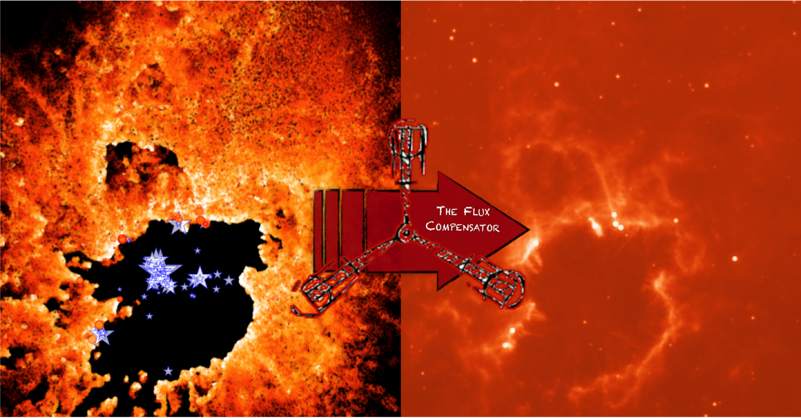
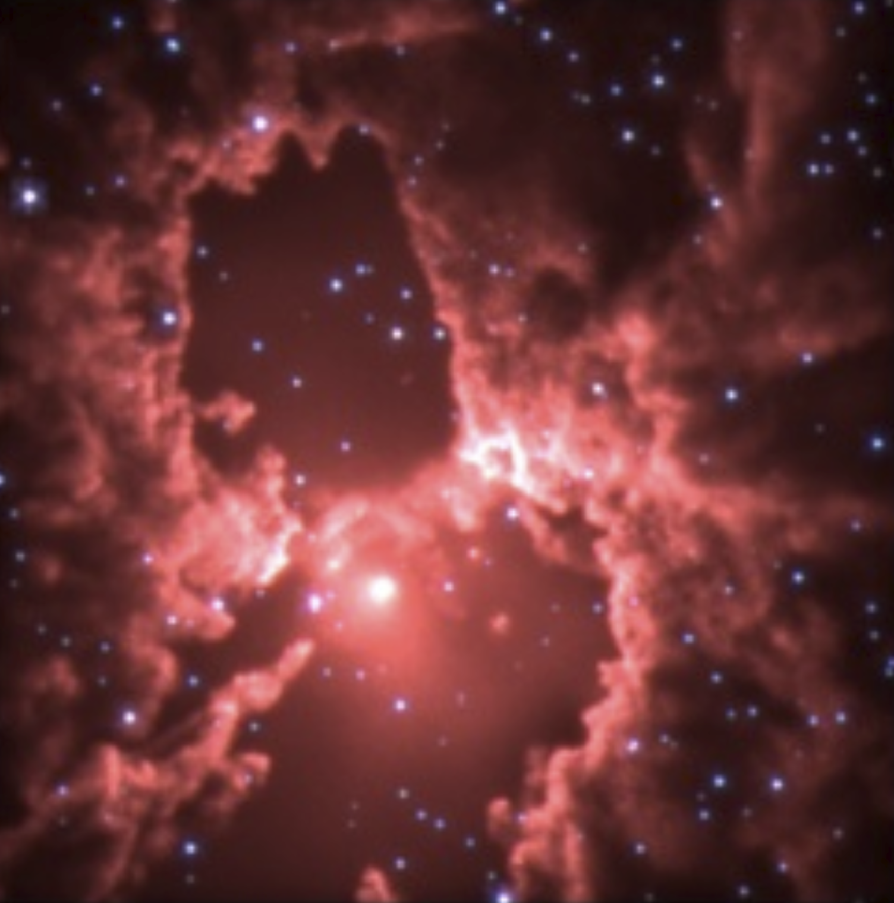

.. _label_gallery:

-----------------------------------------------
Gallery
-----------------------------------------------

The FluxCompensator can close the loop between theoretical simulations and real observations as it can produce "realistic synthetic observations" of the simulations. The example below shows a star-forming region simulated by `Dale et al. 2012 <http://adsabs.harvard.edu/abs/2012MNRAS.424..377D>`_ (left) and the corresponding synthetic MIPS 24 micron "realistic synthetic observation" (right) published in `Koepferl et al. 2016 <http://adsabs.harvard.edu/abs/2016arXiv160302270K>`_.

   
With the FluxCompensator you use built-in pre-constructed pipelines and interfaces for the most common continuum surveys in the infrared such as GLIMPSE, MIPSGal and HiGAL. Below you can see the same simulation as above, but this type observed with multiple synthetic observatories in the FluxCompensator and blended in a realistic background (published in `Koepferl et al. 2016 <http://adsabs.harvard.edu/abs/2016arXiv160302270K>`_).

.. figure:: all_bands_ds9.pdf
   :align: center
   :width: 500pt

With the FluxCompensator you can add field stars to your "realistic synthetic observations" to make them even more realistic. Another simulation time step of the `Dale et al. 2012 <http://adsabs.harvard.edu/abs/2012MNRAS.424..377D>`_ star-forming region observed with the "synthetic" GLIMPSE interface in the FluxCompensator including synthetic field stars is displayed below.

