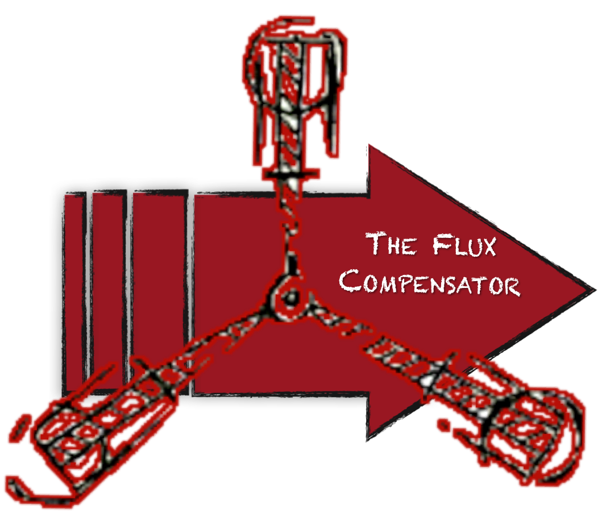

.. FluxCompensator documentation master file, created by
   sphinx-quickstart on Mon Sep  2 11:11:34 2013.
   You can adapt this file completely to your liking, but it should at least
   contain the root `toctree` directive.

FluxCompensator Documentation
=============================

Introduction
------------

This is the documentation for the FluxCompensator, an open-source post-processing tool of continuum radiative transfer codes. It is capable of producing "realistic" synthetic observations from the output of radiative transfer codes such as `Hyperion <http://www.hyperion-rt.org>`_. The FluxCompensator (as `Hyperion <http://www.hyperion-rt.org>`_) can be accessed via Python scripts. However, little knowledge of Python is required as we provide pre-constructed pipelines and interfaces.
  
Incentive
----------

View the FluxCompensator Images in the ...

.. toctree::
   :maxdepth: 1
   
   gallery/gallery.rst

Compatibility with Other Codes
------------------------------

The FluxCompensator package has been designed to be able to post-process the radiative transfer output of `Hyperion <http://www.hyperion-rt.org>`_. It follows the same philosophy as `Hyperion <http://www.hyperion-rt.org>`_ in using object-oriented Python scripts and making it therefore more user friendly and generic. Very little Python knowledge is required to work with either `Hyperion <http://www.hyperion-rt.org>`_ or the FluxCompensator. As the tool has been designed for `Hyperion <http://www.hyperion-rt.org>`_, some features of the FluxCompensator will only work optimally if `Hyperion <http://www.hyperion-rt.org>`_ inputs are used. 
However, in principle it should be easy to adapt the FluxCompensator so that it can read in any arbitrary ideal observations from other radiative transfer codes, provided that they can output a spectral cube. Aside from the input, most of the code is not specific to `Hyperion <http://www.hyperion-rt.org>`_. For assistance with other radiative transfer outputs contact as `here <koepferl@usm.lmu.de>`__.

Documentation
-------------

.. toctree::
   :maxdepth: 1
   
   setup/setup.rst
   FCobjects/objects.rst
   pipeline/virtual_pipeline.rst
   postprocessing/post.rst 
   outputs/output.rst
   

Built-in Tools
--------------

.. toctree::
   :maxdepth: 2
      
   built-in/build.rst

Tutorials
---------
.. toctree::
   :maxdepth: 2
      
   tutorials/tutor.rst

Authors
---------

* `Christine Maria Koepferl <http://star-www.st-and.ac.uk/~cmk8>`_
* `Thomas Robitaille <http://www.mpia-hd.mpg.de/~robitaille/>`_

For assistance contact as `here <koepferl@usm.lmu.de>`__.

Credits
---------
This work was carried out in the Max Planck Research Group "Star formation throughout the Milky Way Galaxy" at the Max Planck Institute for Astronomy lead by `Thomas Robitaille <http://www.mpia-hd.mpg.de/~robitaille/>`_. We further acknowledge support from the International Max Planck Research School for Astronomy and Cosmic Physics (IMPRS) at the University of Heidelberg and the Bayerischen Gleichstellungsförderung. 

References
----------
Note that this text is merely the documentation of the FluxCompensator code and therefore, please consider Koepferl & Robitaille (subm. to ApJ) for relevant references. When using the FluxCompensator please cite Koepferl & Robitaille (subm. to ApJ) and relevant references therein. 

.. important:: We do not take any responsibility about the correctness of the results. The users are responsible that they understand the physical processes happening in the FluxCompensator and that the results are reasonable. 

Otherwise -- have fun :)

Indices and Tables
------------------

.. toctree::
   :maxdepth: 2
   
   advanced/contens_api.rst
   
* :ref:`genindex`

* :ref:`search`

.. * :ref:`modindex`
