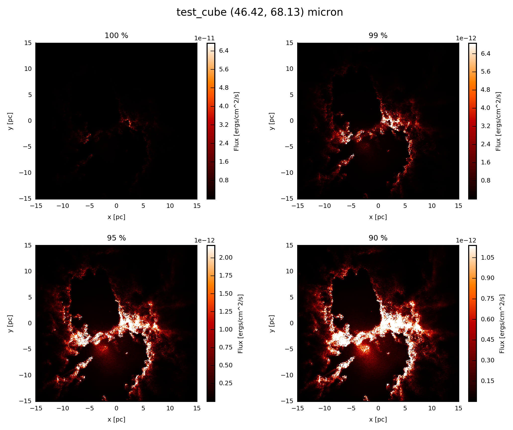
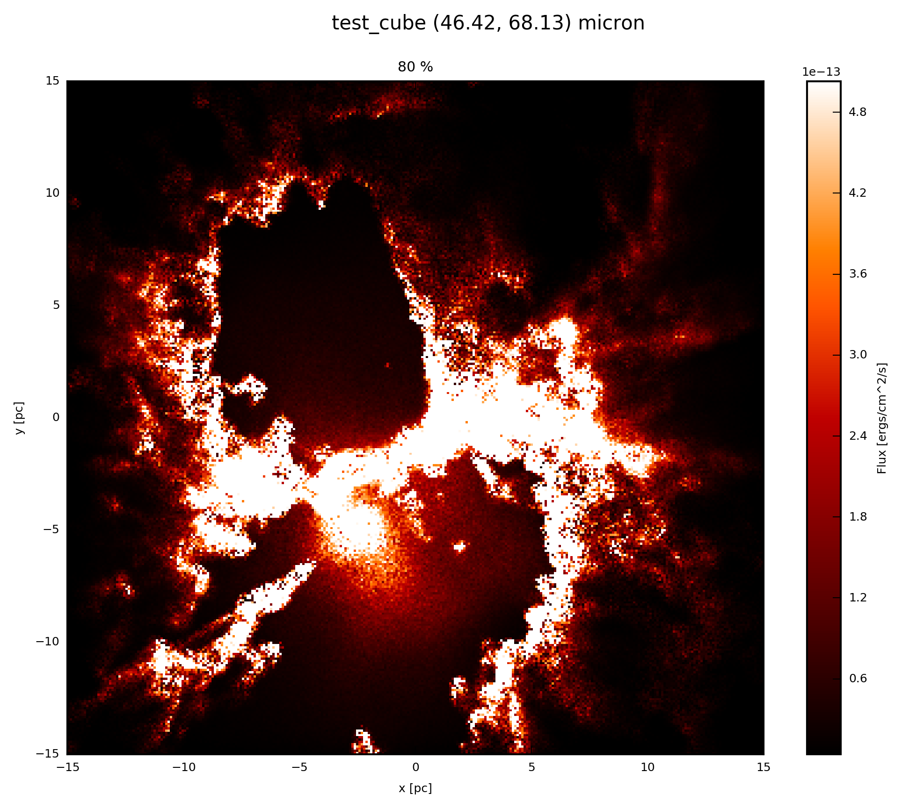

.. _label_image_plot:

============
Image Plots
============

At any point in the :ref:`label_virtual_pipeline`  the ``val`` of the :ref:`FC_objects <label_objects>` 

* :class:`~fluxcompensator.cube.SyntheticCube`
* :class:`~fluxcompensator.image.SyntheticImage`

of dimension

* 3D (x, y, wav)
* 2D (x, y)

can be visualized by using 

* :meth:`fluxcompensator.cube.SyntheticCube.plot_image`
* :meth:`fluxcompensator.image.SyntheticImage.plot_image`

to plot 

* a image slice of the entire
* the entire 

image, respectively.

The method plots the ``FC_object.val`` (3D) close to a certain requested ``wav_interest``. Since in a ``FC_object.val`` (2D) has only one entry in ``wav``, ``wav_interest`` is not necessary.

One of the plotting modes has to be chosen:

* ``multi_cut``: 
	Will plot the selected image at four cuts [100, 99, 95, 90]%. 
	Default is ``None`` and enable with ``True``.
* ``single_cut``: 
	Will plot the selected image at a selected cut between [0, 100]%. 
	Default is ``None`` and enable with e.g ``80.``.
* ``set_cut``: 
	Will plot the selected image within an upper and lower cut in the ``units`` of the ``val``. 
	Default is ``None`` and enable with range e.g ``(1e-14,9.4e-13)``.

To disable the different modes put ``None`` in the respected input parameters. 

Of course you can plot different modes at the same time. 

With ``prefix`` you can choose your own name for the plotted image (e.g. ``prefix.png``). 

.. note:: If ``prefix`` is enabled, only one plotting parameter can be chosen to prevent overplotting. If the default naming chain is enabled (``prefix=None``), more than one plotting mode can be chosen.

``name`` is a part of the name of the output file (e.g. ``FC_object.name``_image_``plot_*.png``). Where ``*`` stands for the modes and the wavelength interval within plotting. 

.. note:: If ``prefix`` is enabled, ``name`` is not required and hence its default is ``None``.

You also can adjust the resolution with ``dpi``.

For further information see:

* :class:`~fluxcompensator.utils.plot.MakePlots`

Example: Plot
^^^^^^^^^^^^^^

If the :ref:`FC_object <label_objects>` is a :class:`~fluxcompensator.cube.SyntheticCube` you can produce an image output at ``wav_interest = 60.`` in all modes, by adding to your script::

    # plot FC_object.val (3D) at 60 microns with default naming
    FC_object.plot_image(name='plot', wav_interest=60., set_cut=(1e-14,
                         9.4e-13), single_cut=80., multi_cut=True, dpi=300)
    
    # plot FC_object.val (3D) at 60 microns with prefix
    FC_object.plot_image(prefix='prefix1', wav_interest=60., multi_cut=True,
                         dpi=300)
    FC_object.plot_image(prefix='prefix2', wav_interest=60., set_cut=(1e-14,
                         9.4e-13), dpi=300)
    FC_object.plot_image(prefix='prefix3', wav_interest=60., single_cut=80., 
                         dpi=300)

In the default naming case you will find the files
 
* ``FC_object.name`` ``_image_`` ``plot`` ``_multi_cut_46.42_68.13.png``
* ``FC_object.name`` ``_image_`` ``plot`` ``_set_cut_1.00e-14_9.40e-13_46.42_68.13.png``
* ``FC_object.name`` ``_image_`` ``plot`` ``_single_cut_80.0%_46.42_68.13.png`` 

and in the prefix case you will find the files

* ``prefix1.png``
* ``prefix2.png``
* ``prefix3.png`` 

in the same directory as ``example.py``. If you extend the example described in :ref:`label_cube`, the resulting image will be exactly the same as displayed below.

.. figure:: ../media/test_cube_image_plot_set_cut_1.00e-14_9.40e-13_46.42_68.13.png
   :align: center
   :width: 500pt

If the :ref:`FC_object <label_objects>` is a :class:`~fluxcompensator.image.SyntheticImage`, because it was already :ref:`convolved with a filter <label_filter>` before, you plot with the following::

    # plot FC_object.val (2D) at FC_object.wav
    FC_object.plot_image(name='plot', set_cut=(1e-14, 9.4e-13), single_cut=80.,
                         multi_cut=True, dpi=300)
    
    # plot FC_object.val (2D) at FC_object.wav with prefix
    FC_object.plot_image(prefix='prefix1',  multi_cut=True, dpi=300)
    FC_object.plot_image(prefix='prefix2',  set_cut=(1e-14, 9.4e-13), dpi=300)
    FC_object.plot_image(prefix='prefix3',  single_cut=80., dpi=300)
    

In the default naming case you will find the files

* ``FC_object.name`` ``_image_`` ``plot`` ``_multi_cut_*.png``
* ``FC_object.name`` ``_image_`` ``plot`` ``_set_cut_1.00e-14_9.40e-13_*.png``
* ``FC_object.name`` ``_image_`` ``plot`` ``_single_cut_80.0%_*.png`` 

and in the prefix case you will find the files

* ``prefix1.png``
* ``prefix2.png``
* ``prefix3.png`` 

in the same directory as ``example.py``, where ``*`` stands for the filter limits.    