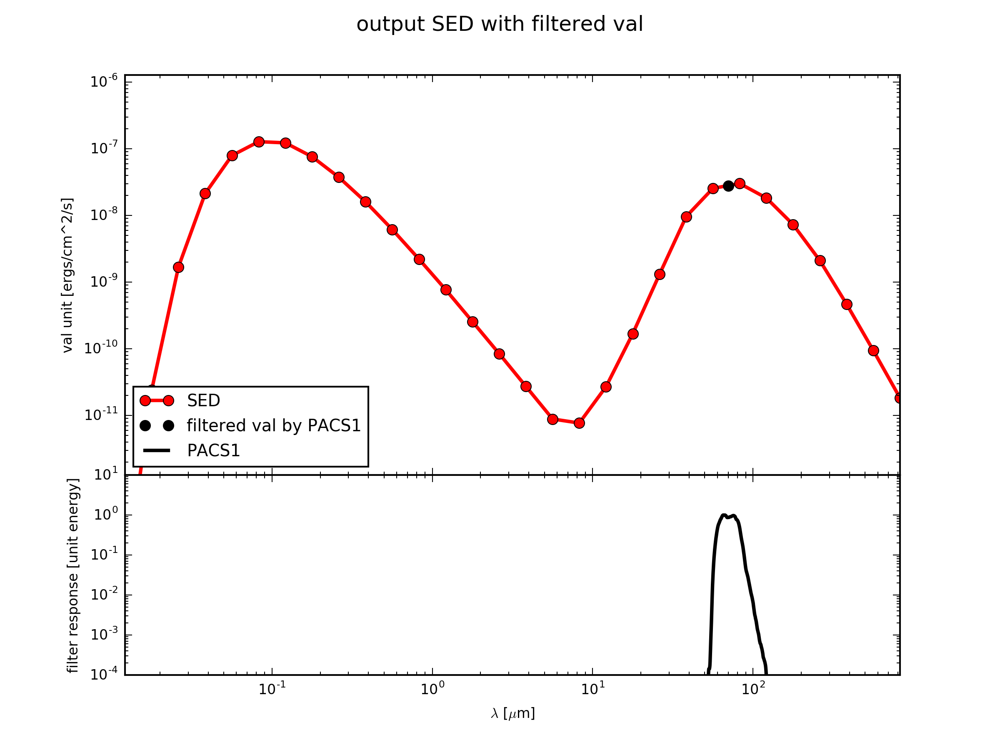

.. _label_sed_plot:

==========
SED Plots
==========

At any point in the :ref:`label_virtual_pipeline` you can plot a :class:`~fluxcompensator.flux.SyntheticFlux` :ref:`FC_object <label_objects>` of 0D (wav) dimension created by 

* :ref:`convolve_filter <label_filter>`

with a :class:`~fluxcompensator.sed.SyntheticSED` :ref:`FC_object <label_objects>` of 1D (wav) dimension from 

* :ref:`get_rough_sed <label_rough>`
* `ModelOutput.get_sed <http://docs.hyperion-rt.org/en/stable/api/hyperion.model.ModelOutput.html?highlight=get_sed#hyperion.model.ModelOutput.get_sed>`_

in one plot.

Plot SyntheticFlux Value with SED
----------------------------------

To plot 0D ``val`` passed by a :ref:`FC_object <label_objects>` ``f`` with a certain 1D SED ``s`` you can do this with :meth:`fluxcompensator.flux.SyntheticFlux.plot_sed_filter`. Add to your script::

    # plot f.val with s.val in one plot
    f.plot_sed_filter(wav_sed=s.wav, rough_sed=s.val, ymin=1.e-5, dpi=300)
	
With ``ymin`` you can adjust the minimum ``val`` of the vertical axis. With ``dpi`` you can change the resolution of the plot. The output you will find in the file ``FC_object.name`` ``_process-output_SF-`` ``FC_object.fiter['name']`` ``.png`` in the same directory as ``example.py``. 

.. note:: Here ``s`` does not necessarily must to be a member of :ref:`FC_object <label_objects>` but it needs to be a 1D ``numpy array``.

If you extend the example described in :ref:`label_cube`, to get :ref:`FC_object <label_objects>` ``f`` as the example in :ref:`convolve_filter <label_filter>` and the :ref:`FC_object <label_objects>` ``s`` as the example in :ref:`get_rough_sed <label_rough>` ::

	from hyperion.model import ModelOutput
	from hyperion.util.constants import kpc
	from fluxcompensator.cube import *
	
	
	# read in from Hyperion
	m = ModelOutput('hyperion_output.rtout')
	array = m.get_image(group=0, inclination=0, distance=10*kpc,
	                    units='ergs/cm^2/s')
    
	# initial FluxCompensator array
	FC_object = SyntheticCube(input_array=array, unit_out='ergs/cm^2/s',
	                  name='test_cube')

	# collapse 3D cube to rough SED
	FC_object_s = FC_object.get_rough_sed()

	import fluxcompensator.database.missions as filters

	# call object from the filter database
	filter_input = getattr(filters, 'PACS1_FILTER')

	# convolve with filter object
	filtered = FC_object.convolve_filter(filter_input, plot_rebin=None,
	                                     plot_rebin_dpi=None)

	# collapse filtered.val
	FC_object_f = filtered.get_total_val()

	# plot single flux value and SED in one plot
	FC_object_f.plot_sed_filter(wav_sed=FC_object_s.wav, val_sed=FC_object_s.val, ymin=1.e-5, dpi=300)
    

the plot ``test_cube_process-output_SF-PACS1.png`` will be exactly the same like the following.

Plot Many Fluxes with SED
--------------------------

At some point you might want to loop over many filters and you might have many 0D ``val`` which you compare to a SED in a plot.
To do so, you save all the different 0D ``val``  of :class:`~fluxcompensator.flux.SyntheticFlux` in an array (e.g. ``val_array``) and you also have to store the wavelength of the filters in ``wav_array`` and their names in ``name_array``. 

To plot those arrays with the SED ``s`` with the :meth:`fluxcompensator.sed.SyntheticSED.plot_sed_multi_filter` by adding to you script::

    # plot all filters in loop with filtered val and rough_sed
    FC_object_s.plot_sed_multi_filter(multi_filter_val=val_array,
                            multi_filter_wav=wav_array, names=filter_array,
                            ymin=1e-5, filter_label_size=None, dpi=300)

With ``ymin`` you can adjust the minimum ``val`` of the vertical axis. With ``dpi`` you can change the resolution of the plot. If ``filter_label_size=True`` the name of the filters are printed in a small font size. If you want to adjust the size just replace ``True`` with a number.

You will find the output file ``FC_object.name`` ``_process-output_SS-multi-filter.png`` in the same directory as ``example.py``.

For further information see the tutorials of :ref:`label_multi_filter`.
     