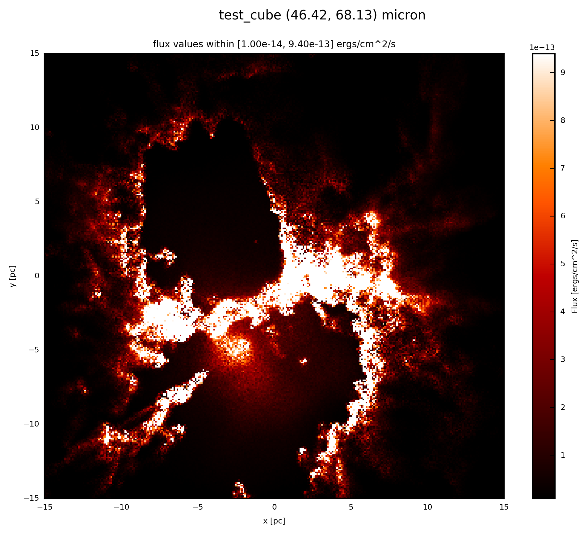

.. _label_extinction:

==========
Extiction
==========

Accounting for reddening is essential when making synthetic observations more realistic. The FluxCompensator enables the user to use its own extinction law or to derred with the law provided by the FluxCompensator. 

In any case the methods 

* :meth:`fluxcompensator.cube.SyntheticCube.extinction`
* :meth:`fluxcompensator.image.SyntheticImage.extinction`
* :meth:`fluxcompensator.sed.SyntheticSED.extinction`
* :meth:`fluxcompensator.flux.SyntheticFlux.extinction`

will derred the physical properties ``val`` of dimensions

* 3D (x, y, wav)
* 2D (x, y) 
* 1D (wav) 
* 0D (wav) 

of the different :ref:`FC_objects <label_objects>`.

First, for all wavelengths the opacity :math:`k_\lambda` will be interpolated. Afterwards the wavelength dependent extinction :math:`A_\lambda` will be calculated with the given visual opacity :math:`k_V` (e.g. :math:`k_V = 211.4 cm^2/g` for the law used here):

.. math:: A_{\lambda}=A_V \cdot \frac{k_\lambda}{k_V}
	
Now ``val`` can be deredded:

.. math:: F_{extinced}(\lambda)=F_{initial}(\lambda) \cdot 10^{-0.4 \cdot A_\lambda}

Use Own Extinction Law
^^^^^^^^^^^^^^^^^^^^^^^

If you want to use your own extinction law you need to prepare an file (e.g. my_extinction.txt) with 2 columns. In column 1 write the wavelength in microns and in column 2 write the opacity in cm^2/g. 

Furthermore you need to interpolate the opacity ``k_v`` at 0.550 microns (e.g. ``k_v = 200.`` ). 

Now derred a passed :ref:`FC_objects <label_objects>` with your extinction law by adding to your script::
    
    # dered with own extinction law
    ext = FC_object.extinction(A_v=20., input_opacities='my_extinction.txt',
                               k_v=200.)

Built-in Extinction Law
^^^^^^^^^^^^^^^^^^^^^^^^

The extinction law provided here is from `Kim et al. 1994 <http://adsabs.harvard.edu/abs/1994ApJ...422..164K>`_ (the law used in the SED fitting tool published in `Robitaille et al. (2007) <http://iopscience.iop.org/0067-0049/169/2/328/>`_. For further infomation see `<http://caravan.astro.wisc.edu/protostars/>`_.

.. note:: Note that this extinction law breaks down above 1 mm and below 0.02 microns.

Now derred a passed :ref:`FC_objects <label_objects>` with the built-in extinction law by adding to your script::
	
    # dered with provided extinction law
    ext = FC_object.extinction(A_v=20.)

Example: Plot
^^^^^^^^^^^^^^

If the :ref:`FC_object <label_objects>` is a :class:`~fluxcompensator.cube.SyntheticCube`, you can produce an image output by following the instruction :ref:`label_image_plot`.

The essentials are given here; add to your script::

    # plot ext.val (3D) at 60 microns
    ext.plot_image(name='ext', wav_interest=60., set_cut=(1e-14, 9.4e-13),
                   single_cut=None, multi_cut=None, dpi=300)

In this case you will find the file ``test_cube_image_ext_set_cut_1.00e-14_9.40e-13_46.42_68.13.png`` in the same directory as ``example.py``. If you extend the example described in :ref:`label_cube`, the resulting image will be exactly the same as displayed below.

If the :ref:`FC_object <label_objects>` is a :class:`~fluxcompensator.image.SyntheticImage`, because it was already :ref:`convolved with a filter <label_filter>` before, you plot with the following::

    # plot ext.val (2D) at ext.wav
    ext.plot_image(name='ext', set_cut=(1e-14, 9.4e-13), single_cut=None,
                   multi_cut=None, dpi=300)

In this case you will find the file ``test_cube_image_ext_set_cut_1.00e-14_9.40e-13_*.png`` in the same directory as ``example.py``, where ``*`` stands for the filter limits.
	