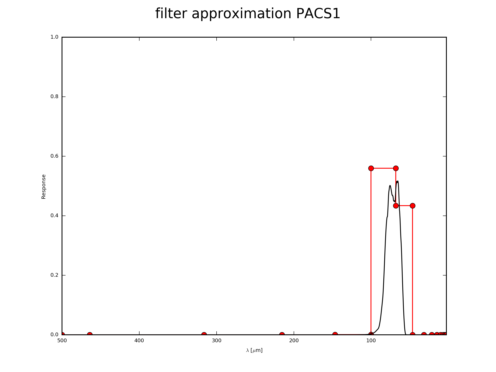
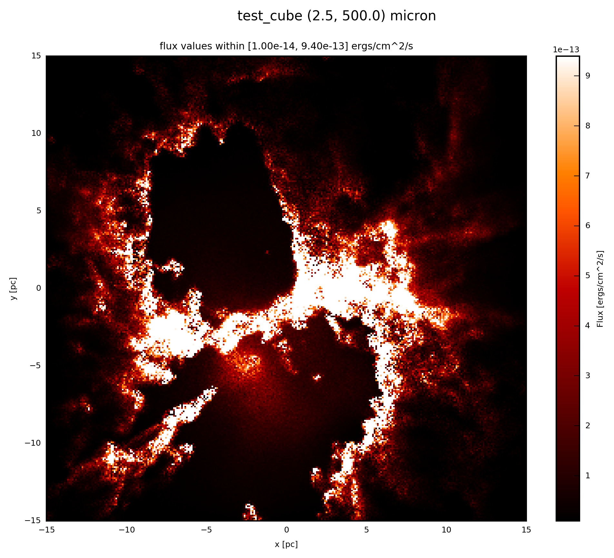

.. _label_filter:

=====================
Convolve with Filters
=====================

As in a normal telescope at some point you might want to select a certain wavelength. In telescopes this can be achieved by using filters. Here we need to convolve the synthetic measurements with a filter function.

With 

* :meth:`fluxcompensator.cube.SyntheticCube.convolve_filter`
* :meth:`fluxcompensator.sed.SyntheticSED.convolve_filter` 

you can convolve a synthetic measurement ``val`` of 

* 3D (x, y, wav)
* 1D (wav)

dimension in the different :ref:`FC_objects <label_objects>`, respectively, within a certain wavelength bin. After the convolution an 

* image :class:`~fluxcompensator.image.SyntheticImage` 
* photometric val :class:`~fluxcompensator.val.SyntheticFlux`

remains, respectively, for a certain band.

To initialize the convolution add to you script::

    # convolve with filter object
    filtered = FC_object.convolve_filter(filter_input, plot_rebin=None,
                                         plot_rebin_dpi=None)
	
``filter_input`` can be either your own filter function or a function from the :ref:`label_database` of routinely applied detectors. ``plot_rebin=True`` plots the initial filter response and the new response after rebinning. With ``plot_rebin_dpi`` one can adjust the resolution of the plot. If you use the PACS1 filter ``PACS1_FILTER`` from the :ref:`label_database` (see below), you produce the following plot of the rebinning::

    # convolve with filter object
    filtered = FC_object.convolve_filter(filter_input, plot_rebin=True,
                                         plot_rebin_dpi=300)
     
In this case you will find the file ``test_cube_process-output_FR-PACS1-rebin.png`` in the same directory as ``example.py``. If you extend the example described in :ref:`label_cube`, the resulting plot will be exactly the same as displayed below.

Arbitrary Filter Function
^^^^^^^^^^^^^^^^^^^^^^^^^

If you have your own filter function in a file with 2 columns (e. g ``filter.txt``). Column 1 contains the wavelength in microns and column 2 contains the filter response::

    # wav [microns] 	response
    3.1			0.0
    3.0			0.3
    2.0			0.3
    1.9			0.0		

Further information of the filter is needed:

* central wavelength of the filter ``waf_0``
* ``alpha`` val of filter
* ``beta`` val of filter

``alpha`` represents the exponent in the power law if 

.. math:: \nu^\alpha F_{\nu}=const.

``beta`` represents the exponent in the power law if 

.. math:: R_{input}=R \nu^\beta.

If the input of the response in column 2 is in ...

* unit energy --> ``beta=-1``
* unit photon --> ``beta=0``

For a detailed description see Robitaille et al. (2007, Appendix) and Koepferl & Robitaille (subm. to ApJ).

Now to define your own filter, add the following to you script::

    from fluxcompensator.filter import Filter
    
    # create own filter object
    filter_input = Filter(name='my_filter', filter_file='filter.txt',
                          waf_0=2.5, alpha=1, beta=0)

:ref:`label_database` Filter Function
^^^^^^^^^^^^^^^^^^^^^^^^^^^^^^^^^^^^^^^^^^^^^^^^^^^^^^^^^^^^^^^^^^^^^^^^^^^^^^^^^^^^^^^^^^^^^^^^^^^^^^^^^^^^^^^^^^^^^^^^^^^^

The FluxCompensator contains 24 routinely applied filters from 2MASS, SPITZER, HERSCHEL, WISE and IRAS in its :ref:`label_database`. If you want to use this predefined filter objects (e.g. ``PACS1_FILTER``), add the following to your script::

    import fluxcompensator.database.missions as filters 
    
    # call object from the filter database
    filter_input = getattr(filters, 'PACS1_FILTER')
	
The filter objects in the :ref:`label_database` (e.g. ``PACS1_FILTER``) can be called by using ``getattr`` and the ``str`` of the filter object.

Possible names of the attributes are::

	filter	          waf_0	    waf_min	   waf_max	alpha   beta
                                                               
	J_2MASS_FILTER     	  1.235	    1.062	   1.450	  1	  0
	H_2MASS_FILTER	    	  1.662	    1.289	   1.914	  1	  0
	K_2MASS_FILTER	    	  2.159	    1.900	   2.399	  1	  0

	IRAC1_FILTER	    	  3.550	    3.081060	   4.010380	  1	  0
	IRAC2_FILTER	    	  4.493	    3.722490	   5.221980	  1	  0
	IRAC3_FILTER	    	  5.731	    4.744210	   6.622510	  1	  0
	IRAC4_FILTER	    	  7.872	    6.151150	  10.496800	  1	  0

	MIPS1_FILTER   	 23.68	   18.005 	  32.207         -2      -1
	MIPS2_FILTER            71.42	   49.95998      111.0222	 -2      -1
	MIPS3_FILTER           155.9	  100.0851 	 199.92		 -2      -1

	IRAS1_FILTER	    	 12.	    7.0	          15.5		  1	 -1
	IRAS2_FILTER	    	 25.	   16.0           31.5		  1	 -1
	IRAS3_FILTER	    	 60.	   27.0           87.0		  1	 -1
	IRAS4_FILTER	    	100.       65.0          140.0		  1	 -1

	PACS1_FILTER	    	 70.	   48.72109985   157.47999573     1	  0
	PACS2_FILTER	    	100.	   48.95959854	 186.91600037     1	  0
	PACS3_FILTER	    	160.	  105.26300049   500.00000000     1	  0

	SPIRE1_FILTER      	250.	  115.01458	 291.41095	 -2	 -1
	SPIRE2_FILTER      	350.	  137.39661      419.45077	 -2	 -1
	SPIRE3_FILTER      	500.	  316.42866	 603.04174	 -2	 -1

	WISE1_FILTER	       	  3.3526    2.53	   6.50 	  2	  0
	WISE2_FILTER	       	  4.6028    2.53	   8.00 	  2	  0
	WISE3_FILTER	      	 11.5608    2.53	  28.55 	  2	  0
	WISE4_FILTER	      	 22.0883    2.53	  28.55 	  2	  0
	

For a list of filter references see Koepferl & Robitaille (subm. to ApJ).

For further information see:

* :class:`fluxcompensator.filter.Filter`

Example: Plot
^^^^^^^^^^^^^^

If the :ref:`FC_object <label_objects>` is a :class:`~fluxcompensator.cube.SyntheticCube`, you can produce an image output by following the instruction :ref:`label_image_plot`.

The essentials are given here; add to your script::

    # plot filtered.val (3D)
    filtered.plot_image(name='filter', set_cut=(1e-14, 9.4e-13),
                        single_cut=None, multi_cut=None, dpi=300)

In this case you will find the file ``test_cube_image_filter_set_cut_1.00e-14_9.40e-13_2.5_500.0.png`` in the same directory as ``example.py``. If you extend the example described in :ref:`label_cube`, the resulting image will be exactly the same as displayed below.

	
