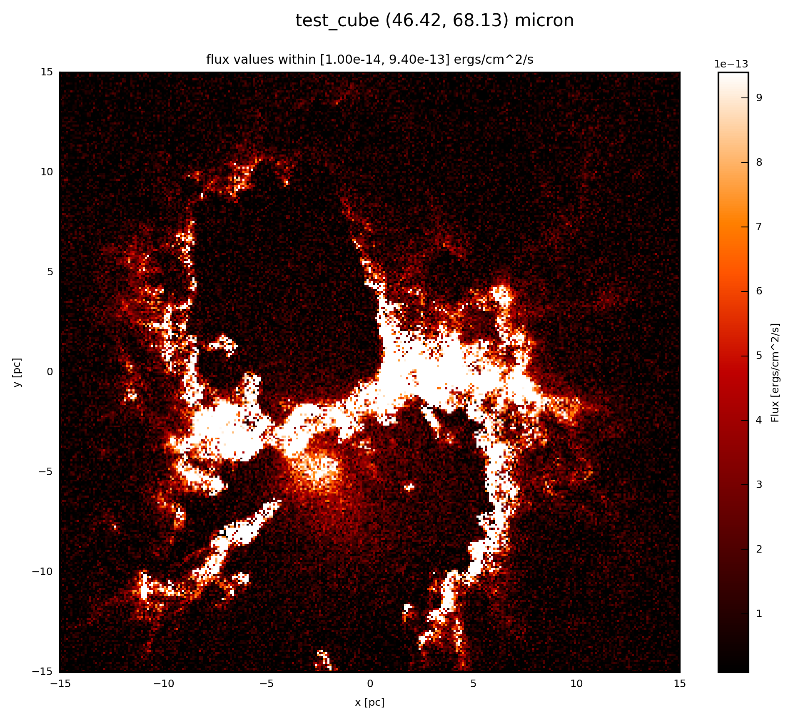

.. _label_noise:

===============
Adding of Noise
===============

Gaussian noise can be added in order to account for random background.

With 

* :meth:`fluxcompensator.cube.SyntheticCube.add_noise`
* :meth:`fluxcompensator.image.SyntheticImage.add_noise` 

you can add random noise to a synthetic measurement ``val`` with

* 3D (x, y, wav)
* 2D (x, y)

dimesion for the different :ref:`FC_objects <label_objects>`, respectively. 

.. note:: In case of a 3D :class:`~fluxcompensator.cube.SyntheticCube` different noise is added to every slice.

In any case add to your script::
	
    # add noise
    noise = FC_object.add_noise(mu_noise=0, sigma_noise=1e-13, seed=2, diagnostics=None)
	   
The ``mu_noise`` and ``sigma_noise`` are given in the same units as the enteries of the image(s). If ``diagnostics=True`` an output of the noise will be created with the name ``test_cube_process-output_SC-noise.fits``. :download:`Here <../media/test_cube_process-output_SC-noise.fits>` you can see an example.

.. warning:: ``add_noise`` will not work for objects of :class:`~fluxcompensator.sed.SyntheticSED` or :class:`~fluxcompensator.flux.SyntheticFlux`.

Example: Plot
^^^^^^^^^^^^^^

If the :ref:`FC_object <label_objects>` is a :class:`~fluxcompensator.cube.SyntheticCube`, you can produce an image output by following the instruction :ref:`label_image_plot`.

The essentials are given here; add to your script::

    # plot noise.val at 60 microns
    noise.plot_image(name='noise', wav_interest=60., set_cut=(1e-14, 9.4e-13),
                     single_cut=None, multi_cut=None, dpi=300)

In this case you will find the file ``test_cube_image_noise_set_cut_1.00e-14_9.40e-13_46.42_68.13.png`` in the same directory as ``example.py``. If you extend the example described in :ref:`label_cube`, the image will be similar the following. 

.. note:: The plot is not exactly the same at the previous cases, since we used random noise. Only if you fixed it with the ``seed`` option.

If the :ref:`FC_objects <label_objects>` is a :class:`~fluxcompensator.image.SyntheticImage`, because it was already :ref:`convolved with a filter <label_filter>` before, you plot with the following::

    # plot noise.val (2D) at noise.wav
    noise.plot_image(name='noise', set_cut=(1e-14, 9.4e-13), single_cut=None,
                     multi_cut=None, dpi=300)

In this case you will find the file ``test_cube_image_noise_set_cut_1.00e-14_9.40e-13_*.png`` in the same directory as ``example.py``, where ``*`` stands for the filter limits.
	
