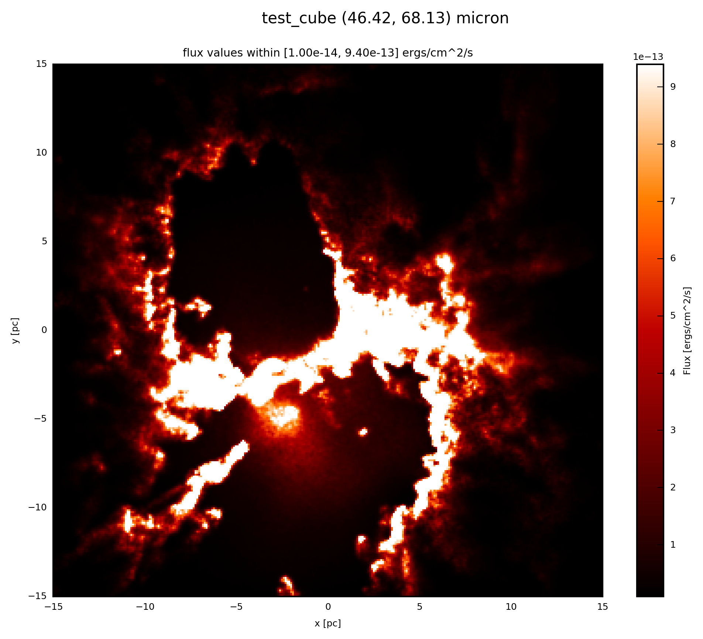

.. _label_psf:

=================
Convolve with PSF
=================

By including the effects of diffraction at the opening of your artificial telescope the synthetic observation becomes more realistic.

With 

* :meth:`fluxcompensator.cube.SyntheticCube.convolve_psf`
* :meth:`fluxcompensator.image.SyntheticImage.convolve_psf` 

you can convolve a physical property ``val`` of

* 3D (x, y, wav)
* 2D (x, y) 

dimension of the different :ref:`FC_objects <label_objects>`, respectively, with a PSF of your choice. You can either convolve with a Gaussian PSF, an arbitrary function or with a file (e.g. provided from a certain telescope).

In any case add to your script::
	
	# convolve with PSF
	psf = FC_object.convolve_psf(psf_object) 
	
	
By choosing from the three following options

.. toctree::
   :maxdepth: 1
   
   FilePSF.rst
   FunctionPSF.rst
   GaussianPSF.rst
   
you set up the ``object_psf`` and convolve your :ref:`FC_object <label_objects>` with it.

.. warning:: ``convolve_psf`` will not work for objects of :class:`~fluxcompensator.sed.SyntheticSED` or :class:`~fluxcompensator.flux.SyntheticFlux`.

Example: Plots 
^^^^^^^^^^^^^^

In what follows the convolution with ``FilePSF``, ``FunctionPSF`` and ``GaussianPSF`` is presented. For comparison to ``FilePSF`` with the two other methods a PACS1 like PSF was produced and convolved with the synthetic reference image. For the setup see the subsections above. 

.. note:: Here, for illustration purpose the almost the same PSF array was used to convolve the image. The different classes however, can be used to create any arbitrary PSF you might want to convolve the image with.

If the :ref:`FC_object <label_objects>` is a :class:`~fluxcompensator.cube.SyntheticCube`, you can produce an image output by following the instruction :ref:`label_image_plot`.

The essentials are given here; when the ``psf_object`` is a ``FilePSF`` add to your script ::

    # psf_object is FilePSF
    
    # plot psf.val (3D) at 60 microns
    psf.plot_image(name='psf_file', wav_interest=60., set_cut=(1e-14, 9.4e-13),
                   single_cut=None, multi_cut=None, dpi=300)

In this case you will find the file ``test_cube_image_psf_file_set_cut_1.00e-14_9.40e-13_46.42_68.13.png`` in the same directory as ``example.py``. If you extend the example described in :ref:`label_cube`, the resulting image will be exactly the same as displayed below.

When the ``psf_object`` is a ``FunctionPSF`` add to your script::

    # psf_object is FunctionPSF
    
    # plot psf.val (3D) at 60 microns
    psf.plot_image(name='psf_func', wav_interest=60., set_cut=(1e-14, 9.4e-13),
                   single_cut=None, multi_cut=None, dpi=300)

In this case you will find the file ``test_cube_image_psf_func_set_cut_1.00e-14_9.40e-13_46.42_68.13.png`` in the same directory as ``example.py``. If you extend the example described in :ref:`label_cube`, the resulting image will be exactly the same as displayed below.

When the ``psf_object`` is a ``GaussianPSF`` add to your script::

    # psf_object is GaussianPSF
    
    # plot psf.val (3D) at 60 microns
    psf.plot_image(name='psf_gauss', wav_interest=60., set_cut=(1e-14,
                   9.4e-13), single_cut=None, multi_cut=None, dpi=300)

In this case you will find the file ``test_cube_image_psf_gauss_set_cut_1.00e-14_9.40e-13_46.42_68.13.png`` in the same directory as ``example.py``. If you extend the example described in :ref:`label_cube`, the resulting image will be exactly the same as displayed below.

.. note:: Here no :ref:`change_resolution <label_resolution>` was used for illustration purposes. It might be however wise to use this tool.

If the :ref:`FC_object <label_objects>` is a :class:`~fluxcompensator.image.SyntheticImage`, because it was already :ref:`convolved with a filter <label_filter>` before, you plot with the following::

    # plot psf.val (2D) at psf.wav
    psf.plot_image(name='psf', set_cut=(1e-14, 9.4e-13), single_cut=None,
                   multi_cut=None, dpi=300)

In this case you will find the file ``test_cube_image_psf_set_cut_1.00e-14_9.40e-13_*.png`` in the same directory as ``example.py``, where ``*`` stands for the filter limits.

