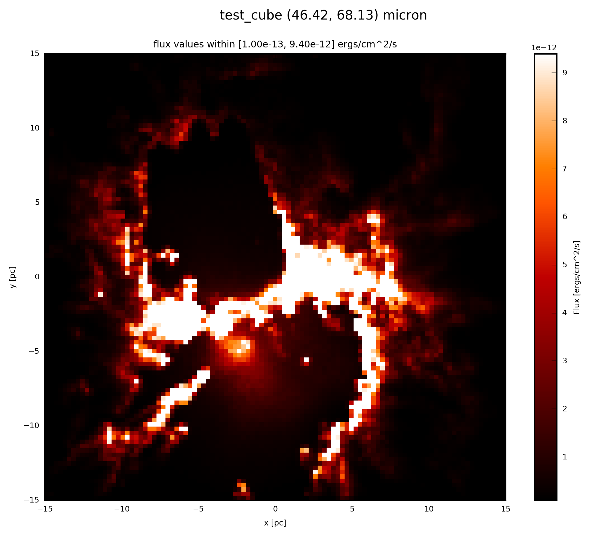

.. _label_resolution:

==========
Resolution
==========

The initial resolution of the physical property ``val`` in the :ref:`FC_objects <label_objects>` is set user through the ``distance`` setting in the `ModelOutput <http://docs.hyperion-rt.org/en/stable/api/hyperion.model.ModelOutput.html#hyperion.model.ModelOutput>`_, as well as the ``set_image_size`` and ``set_image_limits`` in the `image set-up of Hyperion <http://docs.hyperion-rt.org/en/stable/setup/setup_images.html?highlight=set_image_size>`_. However you can change the resolution also after the radiative transfer calculation (e.g. to compare with a certain observation or to convolve afterwards with a PSF from telescope specific a file). 

.. note:: It is always useful to adjust the resolution of the :ref:`FC_object <label_objects>` to the resolution of the mimiced detector (e.g. PACS1).

With 

* :meth:`fluxcompensator.cube.SyntheticCube.change_resolution`  
* :meth:`fluxcompensator.image.SyntheticImage.change_resolution` 

you can change the resolution of ``val`` of 

* 3D (x, y, wav)
* 2D (x, y) 

dimension in the different :ref:`FC_objects <label_objects>`, respectively. In both cases add to your script::
	
	# change resolution
	zoom = FC_object.change_resolution(new_resolution=6., grid_plot=True)
	
``new_resolution`` is the wanted resolution in ``arcsec/pixel``. ``grid_plot=True`` will plot the old and new grid.

.. warning:: ``change_resolution`` will not work for objects of :class:`~fluxcompensator.sed.SyntheticSED` or :class:`~fluxcompensator.flux.SyntheticFlux`.

The new resolution will be updated to the attribute ``resolution`` of the :class:`~fluxcompensator.sed.SyntheticCube` or :class:`~fluxcompensator.sed.SyntheticImage`. When changing the resolution in some cases the width of the images changes. Therefore the attribute ``FOV`` will be updated as well.

Example: Plot
^^^^^^^^^^^^^^

If the :ref:`FC_object <label_objects>` is a :class:`~fluxcompensator.cube.SyntheticCube`, you can produce an image output by following the instruction :ref:`label_image_plot`.

The essentials are given here; add to your script::

    # plot zoom.val (3D) at 60 microns
    zoom.plot_image(name='zoom', wav_interest=60., set_cut=(1e-13, 9.4e-12),
                    single_cut=None, multi_cut=None, dpi=300)

In this case you will find the file ``test_cube_image_zoom_set_cut_1.00e-13_9.40e-12_46.42_68.13.png`` in the same directory as ``example.py``. If you extend the example described in :ref:`label_cube`, the resulting image will be exactly the same as displayed below.

.. note:: The color bar limits on the right are different, here ``set_cut=(1e-13, 9.4e-12)``, because now several old pixels are joined compared to the initial image without resolution ``set_cut=(1e-14, 9.4e-13)``.

If the :ref:`FC_object <label_objects>` is a :class:`~fluxcompensator.image.SyntheticImage`, because it was already :ref:`convolved with a filter <label_filter>` before, you plot with the following::

    # plot zoom.val (2D) at zoom.wav
    zoom.plot_image(name='zoom', set_cut=(1e-13, 9.4e-12), single_cut=None,
                    multi_cut=None, dpi=300)

In this case you will find the file ``test_cube_image_zoom_set_cut_1.00e-13_9.40e-12_*.png`` in the same directory as ``example.py``, where ``*`` stands for the filter limits.

