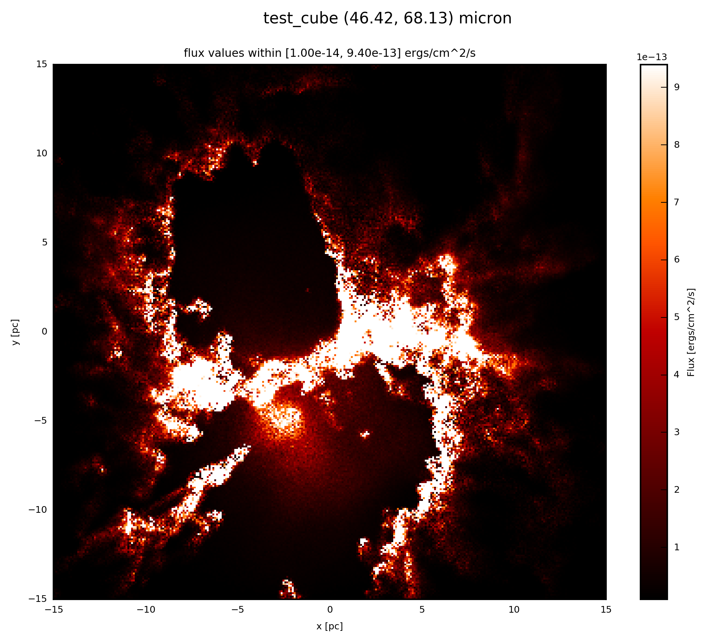

.. _label_cube:

-------------
SyntheticCube
-------------

To start with a `3D image group <http://docs.hyperion-rt.org/en/stable/setup/setup_images.html>`_ from the `Hyperion <http://www.hyperion-rt.org>`_ output your Python script ``example.py`` should contain::

    import numpy as np
    
    from hyperion.model import ModelOutput
    from hyperion.util.constants import kpc
    from fluxcompensator.cube import *
    
    # read in from Hyperion
    m = ModelOutput('hyperion_output.rtout')
    array = m.get_image(group=0, inclination=0, distance=10*kpc,
                        units='ergs/cm^2/s')

Now your image (from image ``group=0`` starting from 0, which contains an image in this example) is scaled to ``300 pc`` in units of ``'ergs/cm^2/s'``. For further details see `ModelOutput <http://docs.hyperion-rt.org/en/stable/postprocessing/extracting_observables.html>`_.

.. seealso:: You can download an example output (density input from `Dale et al. 2012 <http://adsabs.harvard.edu/abs/2012MNRAS.424..377D>`_)  from here: :download:`hyperion_output.rtout <../../fluxcompensator/tests/hyperion_output.rtout>`

To start with the FluxCompensator class :class:`~fluxcompensator.cube.SyntheticCube`, you simlpy write::

    # initial FluxCompensator array        
    FC_object = SyntheticCube(input_array=array, unit_out='ergs/cm^2/s',
                              name='test_cube')

The output unit of the FluxCompensator ``unit_out`` can be defined. Possible are all units like in `get_image <http://docs.hyperion-rt.org/en/stable/api/hyperion.model.ModelOutput.html#hyperion.model.ModelOutput.get_image>`_. ``unit_out='ergs/cm^2/s'`` is the default. 
The name of the FluxCompensator run ``name`` can be defined with a ``str``. All outputs (e.g. plots) will start with this name by default.

You will produce an image output if you follow the instructions :ref:`label_image_plot` or by adding to your script::

    # plot FC_object.val at 60 microns
    FC_object.plot_image(name='init', wav_interest=60., set_cut=(1e-14, 9.4e-13),
                 single_cut=None, multi_cut=None, dpi=300)

In this case you will find the file ``test_cube_image_init_set_cut_1.00e-14_9.40e-13_46.42_68.13.png`` in the same directory as ``example.py``.

