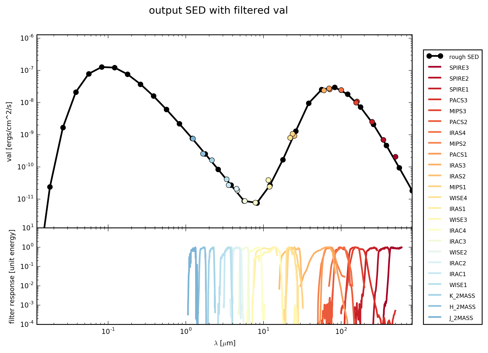

.. _label_multi_filter:

===========================
Multi-filter-Plot
===========================

As in :ref:`label_sed_plot` discribed you can loop over many :ref:`filters <label_filter>` (e.g. all the filters from the :ref:`label_database`) and plot the resulting photometric flux together with the some SED (e.g. :ref:`rough_SED <label_rough>` from the :ref:`initial 3D cube set-up <label_cube>`).

Here is an example how to do that::

    import numpy as np
    
    from hyperion.model import ModelOutput
    from hyperion.util.constants import kpc
    from fluxcompensator.cube import *
    
    
    # read in from Hyperion
    m = ModelOutput('hyperion_output.rtout')
    array = m.get_image(group=0, inclination=0, distance=10*kpc,
                        units='ergs/cm^2/s')
    
    # initial FluxCompensator array
    c = SyntheticCube(input_array=array, unit_out='ergs/cm^2/s',
                      name='test_cube')
    
    # collapse 3D cube to rough SED
    s = c.get_rough_sed()
    
    import fluxcompensator.database.missions as filters
    
    # empty arrays for storage
    val_array = np.array(())
    wav_array = np.array(())
    filter_array = np.array(())
    
    for loop_filter in ['J_2MASS', 'H_2MASS', 'K_2MASS', 'IRAS1', 'IRAS2',
                        'IRAS3', 'IRAS4','IRAC1', 'IRAC2', 'IRAC3', 'IRAC4',
                        'MIPS1', 'MIPS2', 'MIPS3','WISE1', 'WISE2', 'WISE3',
                        'WISE4', 'PACS1', 'PACS2', 'PACS3', 'SPIRE1', 'SPIRE2',
                        'SPIRE3']:
    
        # call object from the filter database
        filter_input = getattr(filters, loop_filter + '_FILTER')
        
        # convolve with filter object
        filtered = c.convolve_filter(filter_input, plot_rebin=None,
                                     plot_rebin_dpi=None)
        
        # collapse FC_object.val
        f = filtered.get_total_val()
    
        # store f.val, f.wav and filter_input in arrays 
        # for plot_sed_multi_filter()
        val_array = np.append(val_array, f.val)
        wav_array = np.append(wav_array, f.wav)
        filter_array = np.append(filter_array, f.filter['name'] + '_FILTER_PLOT')
    
    # plot all filters in loop with f.val and s.val
    s.plot_sed_multi_filter(multi_filter_val=val_array,
                            multi_filter_wav=wav_array, names=filter_array,
                            ymin=1e-5, filter_label_size=None, dpi=300)

In this case you will find the file ``test_cube_process-output_SS-multi-filter.png`` in the directory where you run this script. If you extend the example described in :ref:`label_cube`, the resulting image will be exactly the same as displayed below.

Of course you can add more things to the pipeline (resolution, extinction, PSF convolution, noise, ...) before you store the flux ``val`` in the arrays.